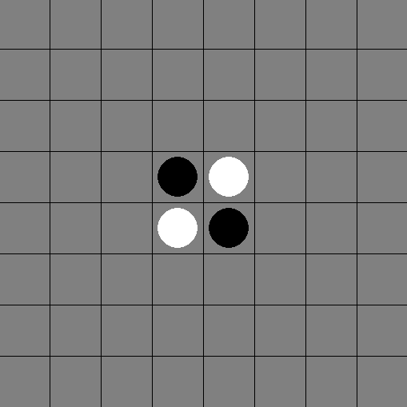

# reversi

A simple version of the game reversi, programmed in Python.

## Dependencies

The game uses the popular pygame module. Pygame can be installed from your terminal or command window if you've got the pip python package manager installed. Just type `pip3 install pygame`

More information about pygame can be found at the [pygame website](https://www.pygame.org/news), and at their [github repository](https://github.com/pygame/pygame).

The game uses a simple script to handle player input, detect which pieces have been captured, and also features a very simple logic to determine which piece the AI should capture to defeat the player.

The player plays as black.

*A GIF demonstrating a match against the AI (player is black)*

## Licence

The code is licenced under the [MIT Licence](https://github.com/waheeduk/reversi/blob/main/LICENSE).
